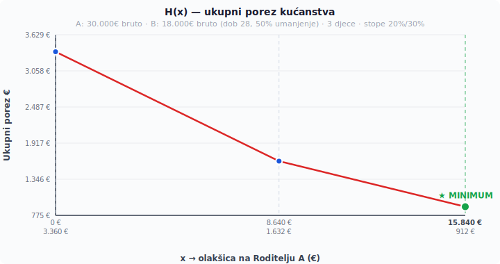

# SmartZPP

Solver za optimalnu raspodjelu poreznih olakšica za djecu i uzdržavane članove između dvoje roditelja. Na temelju bruto dohodaka, poreznih stopa i broja djece određuje raspodjelu koja minimizira ukupni porez kućanstva na obrascu ZPP-DOH.

Problem se svodi na minimizaciju po dijelovima linearne funkcije jedne varijable. Rješenje je $\mathcal{O}(1)$ — neovisno o broju djece, uvijek se evaluira točno 6 kandidata.

## Instalacija

```bash
npm install @sa-hr/smart-zpp --registry=https://npm.pkg.github.com
```

## Korištenje

```js
import { solve } from "@sa-hr/smart-zpp";

const result = solve({
  parentA: { grossAnnual: 30000, taxPaid: 2000, birthYear: 1990, disability: null },
  parentB: { grossAnnual: 18000, taxPaid: 400, birthYear: 1997, disability: null },
  rates: { lower: 0.20, higher: 0.30 },
  childCount: 3,
  depCount: 0,
});
```

### Ulazni parametri

| Parametar | Opis |
|---|---|
| `parentA`, `parentB` | `{ grossAnnual, taxPaid, birthYear, disability }` |
| `grossAnnual` | Bruto godišnji dohodak (€) |
| `taxPaid` | Uplaćeni porez tijekom godine (€) |
| `birthYear` | Godina rođenja (za umanjenje mladih) |
| `disability` | `"full"`, `"partial"` ili `null` |
| `rates` | `{ lower, higher }` — porezne stope općine/grada |
| `childCount` | Broj djece |
| `depCount` | Broj ostalih uzdržavanih članova |

### Povratna vrijednost

| Polje | Opis |
|---|---|
| `x_star` | Optimalni ukupni odbitak za roditelja A (€) |
| `D` | Ukupni fond olakšica (€) |
| `a`, `b` | Početne oporezive osnovice |
| `H_min` | Minimalni ukupni porez kućanstva (€) |
| `τ_A`, `τ_B` | Porez po roditelju u optimumu |
| `T_A`, `T_B` | Oporezive osnovice u optimumu |
| `F_A`, `F_B` | Fiksni osobni odbici |
| `allocation` | `[{ index, coefficient, fractionA }]` — raspodjela po djetetu |
| `candidates` | `[{ x, label, H }]` — svih 6 prijelomnih točaka |

## Kako radi

### Problem

Svako dijete donosi poreznu olakšicu — neoporezivi dio dohotka. Olakšica se može u cijelosti dodijeliti jednom roditelju, drugom, ili podijeliti između njih u koracima od 1%. Cilj je pronaći raspodjelu koja minimizira ukupni porez kućanstva.

### Porezni model

Dohodak svakog roditelja (bruto minus mirovinski doprinosi):

$$I = 0{,}8 \cdot G$$

Od toga se oduzme osobni odbitak — 7.200€ godišnje plus eventualno invaliditet:

$$F = 7\,200 + d$$

Oporeziva osnovica se oporezuje u dva razreda — niža stopa do 60.000€, viša iznad:

$$\tau(T) = \begin{cases} 0 & T \leq 0 \\\ r_L \cdot T & 0 < T \leq 60\,000 \\\ r_L \cdot 60\,000 + r_H \cdot (T - 60\,000) & T > 60\,000 \end{cases}$$

Stope $r_L$ i $r_H$ ovise o općini/gradu (Zagreb 23%/33%, Vukovar 20%/30%).

Umanjenje za mlade na nižu stopu:
- do 25 godina: 0% (potpuno umanjenje)
- 26–30 godina: 50% niže stope

### Ključni uvid

Ukupni fond olakšica za djecu je fiksan:

$$D = \sum_{i=1}^{n} k_i \cdot 7\,200$$

| Dijete | 1. | 2. | 3. | 4. | 5. | 6. | 7. | 8. | 9. |
|---|---|---|---|---|---|---|---|---|---|
| $k_i$ | 0,5 | 0,7 | 1,0 | 1,4 | 1,9 | 2,5 | 3,2 | 4,0 | 4,9 |

Identitet pojedinog djeteta ne utječe na rezultat — bitan je samo ukupni iznos koji svaki roditelj dobije. Problem se svodi na jednu varijablu $x$ — koliko od fonda $D$ ide na roditelja A. Roditelj B dobiva $D - x$.

Oporezive osnovice:

$$T_A(x) = \max(0,\; a - x) \qquad T_B(x) = \max(0,\; b - (D - x))$$

Ukupni porez kućanstva:

$$H(x) = \tau(T_A(x)) + \tau(T_B(x))$$

### Zašto je rješenje $\mathcal{O}(1)$

$H(x)$ je po dijelovima linearna funkcija. Minimum je uvijek na jednoj od 6 prijelomnih točaka:

| Točka | Značenje |
|---|---|
| $x = 0$ | Sve na B |
| $x = a - 60\,000$ | A pada ispod višeg razreda |
| $x = a$ | A pada na nulu |
| $x = D - b$ | B pada na nulu |
| $x = D - b + 60\,000$ | B ulazi u viši razred |
| $x = D$ | Sve na A |

$$x^* = \arg\min_{x_i \in \mathcal{C}}\; H(x_i)$$

| Metoda | Složenost | 3 djece | 9 djece |
|---|---|---|---|
| Brute force (1% koraci) | $\mathcal{O}(101^n)$ | 1.030.301 | $\approx 10^{18}$ |
| Pohlepno | $\mathcal{O}(101n)$ | 303 | 909 |
| **SmartZPP** | $\mathcal{O}(1)$ | **6** | **6** |

### Raspodjela na djecu

Optimalni $x^*$ se raspoređuje na konkretnu djecu pohlepnim algoritmom — od djeteta s najvećim koeficijentom prema najmanjem, zaokruženo na 1%. Korekcijski prolaz ($\pm 1\%$ na jednom djetetu) ispravlja grešku zaokruživanja.

### Vizualizacija

Primjer: Roditelj A zarađuje 30.000€, Roditelj B 18.000€ (28 god, 50% umanjenje), troje djece, stope 20%/30%.



Crvena krivulja je $H(x)$. Plave točke su prijelomne točke. Zelena točka je minimum.

## Parametri (2025.)

| | Vrijednost |
|---|---|
| Osnovni osobni odbitak | 7.200 €/god |
| Granica višeg razreda | 60.000 €/god |
| Mirovinski doprinosi | 20% bruto |
| Prag za uzdržavanog člana | 3.600 €/god |
| Niža stopa (raspon) | 15–23% |
| Viša stopa (raspon) | 25–33% |
| Zadano (ako općina ne odluči) | 20% / 30% |

Izvor: Zakon o porezu na dohodak (NN 152/24)

## Razvoj

```bash
npm install
npm test            # pokreni testove
npm run test:watch  # testovi u watch modu
npm run lint        # provjeri stil koda
npm run lint:fix    # automatski ispravi
```

## Pravna napomena

Informativni alat. Za obvezujući obračun — porezni savjetnik. Bazirano na zakonu od 1.1.2025.

## Licenca

LGPL-3.0-or-later
